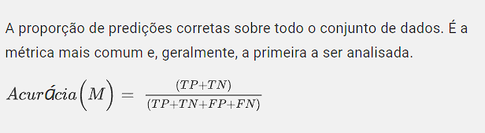
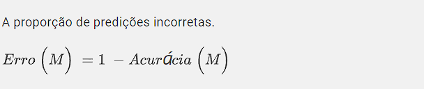
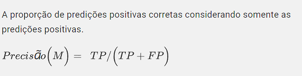
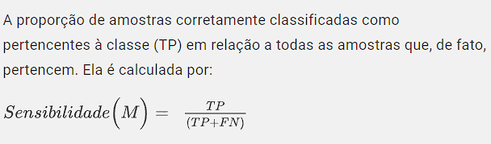
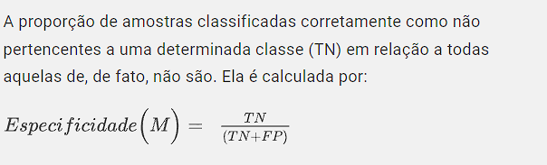
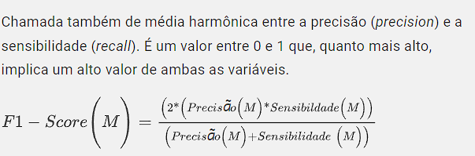
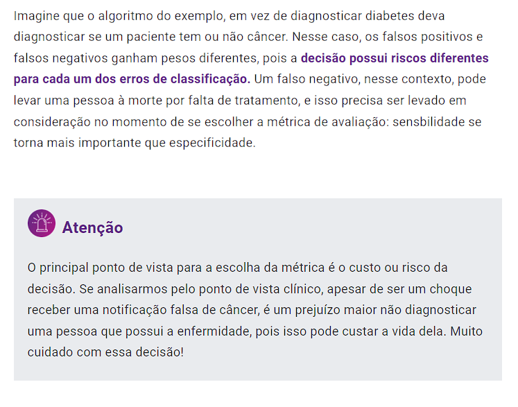

 # Matriz de confusão.

> A partir dessa matriz, calcula-se a acurácia, precisão, score e a sensibilidade do modelo.

 Forma de imaginação clássica da matriz confusa =>

~~~~     
          ["CLASSE ATUAL" ]
          [     | P  | N  ]
 [CLASSE  [   P | TP | FP ]
 PREDITA] [   N | FN | TN ]
~~~~

  + P = Positivo 
  + N = Negativo
  + TP = Positivo Verdadeiro (True Positive) => pessoas que testaram positivo para diabetes e que o sistema previu positivo.
  + FP = Falso Positivo (False Positive) => pessoas que testaram negativo para diabetes e que o sistema previu positivo.
  + TN = Negativos Verdadeiros (False True) => pessoas que testaram negativo para diabetes e que o sistema previu negativo.
  + FN = Verdadeiros Negativos (true False) => pessoas que testaram positivo para diabetes e que o sistema previu negativo.

 ## Cálculo de acurácia.

## Cálulo de taxa de erro.

## Cálculo de precisão.

## Cálculo de sensibilidade.

## Cálculo de especificidade.

## Cálculo de F1-Score (média harmônica)

## Sensibilidade VS Especificidade

